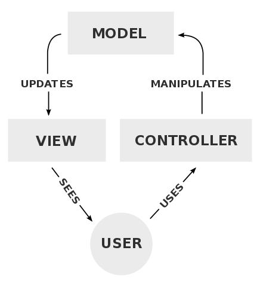

# Architektura kodu w C++Builder

1. [Dobre praktyki programowania obiektowego](#dobre-praktyki-programowania-obiektowego)
    * Model-View-Controler
    * Znaczenie Prawa Demeter (Law Of Demeter)
    * DRY - Don't Repeat Yourself
    * Automatyczne testy
    * Praca zespołowa
1. [Zasady SOLID](#zasady-solid)
1. Wzorce Gang of Four
1. Wzorce projektowe w C++


# Dobre praktyki programowania obiektowego

### Wzorzec MVC 

* Model-View-Controler
* Unikaj kodu spaghetti
    * Nie mieszaj manipulacji na 
* Jedno zadanie realizowane jest przez 3 klasy
    * Dla trywialnych zadań to przerost formy, ale w prawdziwych projektach trywialny kod potrafi się rozrosnąć do ogromnych rozmiarów po uwzględnieniu wszystkich wymagań klienta
* Konieczny mechanizm powiadamiania obiekt => obiekt
* Akcja użytkownika: analizowana jest przez kontroler, który modyfikuje dane i struktury modelu. Z kolei model powiadamia widok o konieczności odświeżenia wyglądu aplikacji


### Prawo Demeter

LoD = Law of Demeter

[Prezentacja na slideshare.net](https://www.slideshare.net/vladimirtsukur/law-of-demeter-objective-sense-of-style)


### DRY - Don't Repeat Yourself

* Unikaj kopiuj-wklej
* Uogólniaj rozwiązanie - odnajduj podobne wzorce i buduj reużywalne moduły
* W metodach używaj mniej niż 5 wyrażeń warunkowych IF / WHILE
* Separacja logiki
* Wydzielaj logikę na zewnątrz
* Staraj się wstrzykiwać wszelkie zależności do klasy (Prawo Demeter)

Lektury:

* Refactoring - Improving the Design of Existing Code
   * autorzy: Martin Fowler, Kent Beck, John Brant, William Opdyke, Don Roberts, Erich Gamma
   * Polski tytuł: Refaktoryzacja. Ulepszanie struktury istniejącego kodu
   * [Tłumaczenie na polski (Helion)](https://helion.pl/ksiazki/refaktoryzacja-ulepszanie-struktury-istniejacego-kodu-martin-fowler-kent-beck-john-brant-william-opdy,refukv.htm)
* Patterns of Enterprise Application Architecture
    * autor: Martin Fowler
    * Polski tytuł: Architektura systemów zarządzania przedsiębiorstwem. Wzorce projektowe
    * [Tłumaczenie na polski (Helion)](https://helion.pl/ksiazki/architektura-systemow-zarzadzania-przedsiebiorstwem-wzorce-projektowe-martin-fowler,szabko.htm)
* Working Effectively with Legacy Code
    * Autor: Michael Feathers
    * Polski tytuł: Praca z zastanym kodem. Najlepsze techniki
    * [Tłumaczenie na polski (Helion)](https://helion.pl/ksiazki/praca-z-zastanym-kodem-najlepsze-techniki-michael-feathers,prazav.htm)
    

# Zasady SOLID


1. SRP = Single Responsibility Principle
    * Klasa powinna być odpowidzialna za jedną rzecz
2. OCP = Open/Close Principle
    * Klasa musi być otwarta na rozbudowę, ale zamknięta na poprawę dobrego kodu
    * Podejrzane: wielopoziomowe if-ów / casów
    * Rozwiązania OOP: abstrakcja, polimorfizm, fabryki
    * Użycie wzorca Fabryki Abstrakcyjnej
        * dostęp do wielu fabryk przez jeden interfejs (klasę abstrakcyjną)
        * dostęp do wyprodukowanych obiektów przez wspólny interfejs lub klasę abstrakcyjną
        * [przykład w C++](https://sourcemaking.com/design_patterns/abstract_factory/cpp/before-after)
        * [przykład w C# / Java](https://refactoring.guru/design-patterns/abstract-factory)
        * [przykład w Delphi](https://www.devfields.com/design-patterns-abstract-factory-pattern/)
3. LSP = Liskov Substition Principle
    * Poprawnie zbudowane drzewo dziedziczenia nie wymaga nadpisywania metod ojca, w celu poprawnego działania algorytmu
    * ```TKwadrat != class(TProstokąt)```
        * zobacz jak działa metoda WyliczPole
    * poprawnie: 
        ```
        TKwadrat = class(TFigure)
        TProstokąt = class(TFigure)
        ```
4. ISP = Interface Segreation Principle
    * Podziel interfejsy na mniejsze (spójne dziedzinowo)
5. DIP = Dependency Invertion Principle
    * Klasy z dwóch różnych warstw separuj interfejsami
    * Przykład: Klasy dziedzinowe (realizujące funkcjonalność) oraz klasy składujące dane (zbiory danych).
    * Jeśli klasa warstwy wyższej tworzy obiekty warstwy niższej to można zastosować: IoC = Inversion of Control
    * Trzech muszkieterów: DIP, IoC, DI (Dependency Injection)
